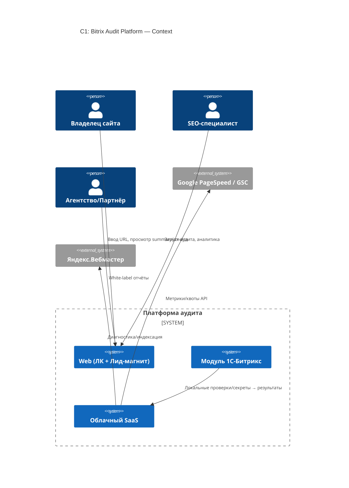
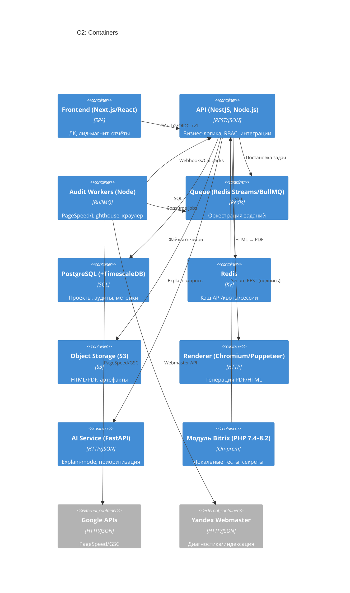
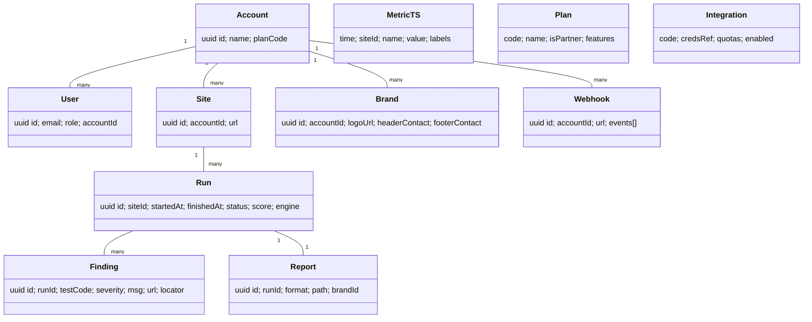

# System Architect (SA) — Ortedos

**Режим:** balanced
**Дата версии документа:** 2025-08-13 (UTC)
**Примечание по приоритетам знаний:** NFR/Constraints (из ролей SA) → PRD → BRD → Research. Конфликты фиксирую в разделе 14.

---

# 01-Brief

**Цель.** Гибридная платформа аудита сайтов на 1С-Битрикс: облачный SaaS-сервис (оркестрация, отчёты, интеграции) + локальный модуль Bitrix (часть проверок, безопасная работа с секретами). В MVP обязательно: лид-магнит (частичный отчёт без регистрации), базовые проверки, интеграции PageSpeed/GSC/Яндекс.Вебмастер, white-label (логотип+контакты). &#x20;

**Ключевые целевые метрики.** Время полного аудита ≤ 5 мин (≤100 страниц); доступность ≥99% в PRD/BRD (см. конфликт с базовыми NFR SA → 14-Дополнения); конверсии воронки: лид-магнит→регистрация ≥20%, отчёт→обращение ≥10%.  &#x20;

**Интейк артефактов.**

| name            | version | date (UTC)           | sha256                                                           | source     |
| --------------- | ------- | -------------------- | ---------------------------------------------------------------- | ---------- |
| 01. PRD.MD      | —       | 2025-08-13T12:19:18Z | 50d5b33c3792a20851f21e5cb87606796edfe81de053ed9cf779ecc3521da17a | PO         |
| 02. BRD.MD (v2) | v2      | 2025-08-13T12:19:18Z | d5606aa9bed754667674c45f67bb1c48ff031f962a448e9723c991d06cf4de7f | BA         |
| 03. Research.MD | —       | 2025-08-13T12:19:18Z | 9273bdb245fbe5e7b426d6dcbf1b48e343c50b42ed1f8cc6fc5bde7a2e39deef | Researcher |

---

# 02-Assumptions

1. Бэкенд MVP — **NestJS (Node.js)**; ИИ/обогащение — отдельный сервис **FastAPI (Python)**. Взаимодействие HTTP/JSON и/или очередь.&#x20;
2. История метрик (Web Vitals/тренды) — **PostgreSQL + TimescaleDB** (hypertables, ретенция, компрессия).&#x20;
3. Интеграции: **R1 PageSpeed Insights**, **R2 пакетный Lighthouse**, дальше гибрид.&#x20;
4. White-label в MVP — логотип+контакты; цвета/шрифты — R2.&#x20;
5. Лид-магнит возвращает **скоринг + 2–3 ключевые ошибки + CTA** без регистрации.&#x20;

---

# 03-C4

## C1: Context



## C2: Containers



## C3: Components

```mermaid
C4Component
title C3: Components
Container_Boundary(api,"API Backoffice (NestJS)"){
  Component(gw,"API Gateway","Rate limit, RFC7807")
  Component(auth,"Auth","OIDC/OAuth2, JWT, RBAC")
  Component(orch,"Audit Orchestrator","Постановка/агрегация")
  Component(score,"Scoring Engine","Веса/штрафы, 0–100, topIssues")
  Component(integ,"Integrations","PageSpeed/GSC/Y.Webmaster")
  Component(rep,"Report Service","Шаблоны, рендер, WL")
  Component(admin,"Plans/Billing Adapter","Тарифы/квоты")
}
Container_Boundary(worker,"Workers"){
  Component(ps,"PageSpeed Client","Batch + cache")
  Component(lh,"Lighthouse Runner","Headless Chrome")
  Component(crawl,"Crawler","Robots-aware")
}
Container_Boundary(ai,"AI"){
  Component(xp,"Explain Engine","P0/P1 explain, impact×effort")
}

Rel(gw, auth, "JWT verify")
Rel(gw, orch, "POST /audits, GET /results")
Rel(orch, score, "calc score/topIssues")
Rel(orch, integ, "fetch metrics")
Rel(orch, rep, "HTML/PDF")
Rel(orch, xp, "explain")
Rel(worker, orch, "callbacks")
```

---

# 04-Data (ER + DDL ключи)

## ER (укрупнённо)



## DDL (фрагменты)

```sql
-- Runs/Audits
CREATE TABLE run(
  id uuid PRIMARY KEY,
  site_id uuid NOT NULL,
  started_at timestamptz,
  finished_at timestamptz,
  status text CHECK (status IN ('queued','running','done','failed')),
  score numeric(5,2) CHECK (score >= 0 AND score <= 100),
  engine text CHECK (engine IN ('cloud','bitrix'))
);

-- Findings
CREATE TABLE finding(
  id uuid PRIMARY KEY,
  run_id uuid NOT NULL REFERENCES run(id),
  test_code text NOT NULL,
  severity text CHECK (severity IN ('info','low','med','high','crit')),
  msg text, url text, locator jsonb
);

-- Tests (конфигурация весов)
CREATE TABLE test(
  code text PRIMARY KEY,
  title text NOT NULL,
  category text CHECK (category IN ('P0','P1','P2','P3')),
  weight numeric(4,2) CHECK (weight >= 0)
);

-- Time series (TimescaleDB)
CREATE TABLE metric_ts(
  time timestamptz NOT NULL,
  site_id uuid NOT NULL,
  name text NOT NULL,
  value double precision NOT NULL,
  labels jsonb DEFAULT '{}'::jsonb
);
-- SELECT create_hypertable('metric_ts','time');
```

---

# 05-APIs (публичные/приватные; `/v1`)

**Публичные (лид-магнит).**

* `POST /v1/public/audits` — `{ "siteUrl": "https://..." }` → `{ "auditId":"uuid","status":"queued" }` (Captcha; 30 req/min/IP; идемпотентность `(IP,siteUrl)` 15 мин). Основание: частичный отчёт без регистрации.&#x20;
* `GET /v1/public/audits/{id}/summary` → `score`, `topIssues[≤3]`, `cta`.&#x20;

**Приватные.**

* `POST /v1/audits` — запуск полного аудита. Scope MVP.&#x20;
* `GET /v1/audits/{id}` — статус, `score`, `breakdown{P0..P3}`. (веса и модель скоринга — см. BRD v2).&#x20;
* `GET /v1/audits/{id}/findings` — список находок.
* `POST /v1/audits/{id}/report` — `{ "format":"pdf","brandId":"uuid" }` → presigned URL (white-label = логотип+контакты).&#x20;
* `POST /v1/integrations/{code}/connect` — OAuth/ключи провайдеров (GSC/Яндекс).&#x20;
* `POST /v1/webhooks/audits/{id}/callback` — входящий callback от воркеров.
* `POST /v1/hooks/tasks/export` — «крюк» под R2-интеграции (Jira/YouTrack/ClickUp); в MVP — заглушка события.&#x20;

**Скоринг (ответы).** `score = max(0, 100 - Σ(weight_i * coverage_i))`; P0=8–10, P1=5–7, P2=3–4, P3=0.5–2. В публичном `summary` — только `score` и ≤3 topIssues.&#x20;

---

# 06-NFR → Tactics

| NFR               | Тактики                                                                                  |
| ----------------- | ---------------------------------------------------------------------------------------- |
| SLA               | Multi-AZ БД/кэш/очередь; health-checks; деградация функционала; квартальный restore-тест |
| p95 latency       | `/v1` ≤200 мс, `/v1/public/*` ≤300 мс; Redis-кэш; connection-pooling                     |
| 5-минутный бюджет | PageSpeed batch + кэш; выборка «точек интереса»; ограничение артефактов Lighthouse (R2)  |
| Безопасность      | TLS≥1.2; OAuth2/OIDC+JWT; RBAC; AES-256 at-rest; подпись запросов модуля; presigned-URL  |
| Масштабирование   | BullMQ; лимиты параллелизма браузеров; горизонтальный скейл воркеров (K8s/ECS)           |
| Наблюдаемость     | Структурные логи без PII; OpenTelemetry; SLI/SLO; алерты квот/очередей                   |
| Стоимость         | Кэш PageSpeed; ретенции Timescale; S3 lifecycle; spot-воркеры                            |

---

# 07-Варианты

**A. NestJS + BullMQ + TimescaleDB + модуль Bitrix (рекомендовано).**

* Совместимо с PRD/BRD/Research, быстрый запуск PageSpeed (R1), Lighthouse (R2), гибко масштабируется; − управление headless-браузерами. TCO: M. Скорость: fast. &#x20;

**B. Full-Python (FastAPI + Celery).**

* Единый язык для ИИ; − экосистема Lighthouse/puppeteer сильнее в Node; TCO: M. Скорость: mid.&#x20;

**C. Serverless воркеры (Cloud Run/Lambda) + API-шлюз.**

* Автоскейл по событиям; − холодные старты/квоты/хром; TCO: S→M. Скорость: mid. (вывод из Research про сложность оркестрации браузеров)&#x20;

---

# 08-Сравнение

| Критерий                     |     A |  B |     C |
| ---------------------------- | ----: | -: | ----: |
| Соответствие PRD/BRD         | **5** |  4 |     4 |
| Скорость MVP (PageSpeed R1)  | **5** |  4 |     4 |
| Риск/квоты внешних API       |     4 |  4 | **5** |
| Операционные риски браузеров | **4** |  3 |     3 |
| TCO 12м                      | **4** |  4 |     4 |

**Итог:** **A** — лучший баланс времени/рисков/стоимости.

---

# 09-Recommended Architecture

**A: NestJS + BullMQ + TimescaleDB + модуль Bitrix.**
Причины: быстрая интеграция PageSpeed (R1) и управляемое добавление Lighthouse (R2); единый SQL-стек с Timescale; сохранение гибрида с локальным модулем (Bitrix) под приватные разделы и секреты. &#x20;

---

# 10-ADR (MADR)

**ADR-001 — Бэкенд NestJS, ИИ-сервис FastAPI** — *Accepted*. Альтернативы: Full-Python, PHP. Последствия: Node-экосистема для Lighthouse/Puppeteer, Python для ИИ.&#x20;
**ADR-002 — PageSpeed→Lighthouse→Гибрид** — *Accepted*. Последствия: минимизация TTM и затрат в R1.&#x20;
**ADR-003 — TimescaleDB поверх PostgreSQL** — *Accepted*. Последствия: ретенции/компрессия, без отдельной TSDB.&#x20;
**ADR-004 — Гибрид с модулем Bitrix** — *Accepted*. Последствия: приватные зоны/секреты локально; публичные проверки в облаке.&#x20;

---

# 11-Риски и митигации

| Риск                                      | Влияние | Вероятн. | Митигации                                                      |
| ----------------------------------------- | ------- | -------: | -------------------------------------------------------------- |
| Квоты/изменения PageSpeed/GSC/Я.Вебмастер | High    |     High | Кэширование, backoff, мониторинг квот, деградация graceful     |
| Антибот-защиты/закрытые зоны              | Med     |      Med | Запуск из модуля Bitrix; уважение robots; user-agent/скорость  |
| Стабильность воркеров с браузерами        | Med     |      Med | Контейнерная изоляция, лимиты параллелизма, автоскейл          |
| Старые версии Bitrix                      | Med     |      Med | Модульная адаптация/профили правил                             |
| Соответствие 152-ФЗ/GDPR                  | High    |      Low | Локальное хранение доступов, AES-256, минимизация PII          |

---

# 12-Roadmap

* **MVP (R1):** лид-магнит (summary), PageSpeed (batch + cache), базовые проверки, интеграции GSC/Яндекс, white-label (логотип+контакты), экспорт PDF, Explain-mode (P0/P1). &#x20;
* **R2:** пакетный Lighthouse, планировщик, графики изменений, расширенные API, конфигурируемые алерты, интеграции таск-систем.&#x20;

---

# 13-Open Questions

1. Норматив списка URL «точек интереса» на сайт (главная/листинг/карточка/контакты) для PageSpeed R1.
2. Границы бесплатного тарифа (число запусков/мес, лимит страниц).
3. Формат `headerContact/footerContact` (строка vs объект).

---

# 14-Дополнения к PRD/BRD/NFR (фиксация расхождений)

* **SLA.** В PRD/BRD — ≥99%; базовые NFR SA требуют 99.9%. Архитектурно закладываю 99.9%, прошу BA/PO подтвердить повышение целевого SLA.&#x20;
* **Стек.** PRD перечисляет NestJS/FASTAPI как варианты; Research подтверждает NestJS как основной → зафиксировано. &#x20;
* **White-label.** В MVP только логотип+контакты (цвета/шрифты — R2) — учтено в API/Report.&#x20;
* **Лид-магнит.** Публичный summary (score+≤3 проблемы+CTA) — учтено в API `/public/*`.&#x20;

---

# 15-RTM (трассируемость)

| Требование (PRD/BRD)                 | Компонент               | API                           | ER                    |
| ------------------------------------ | ----------------------- | ----------------------------- | --------------------- |
| Лид-магнит → summary без регистрации | GW/Orchestrator/Scoring | `/v1/public/audits*`          | Run, Finding          |
| White-label (логотип+контакты)       | Report Service          | `POST /v1/audits/{id}/report` | Report, Brand         |
| Время аудита ≤5 мин (≤100 стр.)      | Workers/Queue           | —                             | MetricTS (время шага) |
| Интеграции GSC/Яндекс                | Integrations            | `/v1/integrations/*`          | Integration           |

---

# 16-Security Model (STRIDE)

* **S:** OIDC/OAuth2, JWT; подпись запросов модуля Bitrix.
* **T:** отчёты с ETag/хэшем; неизменяемые логи.
* **R:** аудит-лог действий; тайм-стемпы; ретеншн 90 дн.
* **I:** TLS≥1.2; AES-256 at-rest; минимизация PII; секреты локально (модуль).
* **D:** `/public/*` — Captcha + 30 rpm/IP; backoff внешних API; очереди.
* **EoP:** RBAC (owner/seo/agency/partner); минимум прав.

---

# 17-Compliance & Privacy

152-ФЗ/GDPR: локальное хранение доступов; AES-256; DPA/ToS; DSAR (экспорт/удаление); логи без PII (90 дн).&#x20;

---

# 18-Ops Plan

* **SLI/SLO:** SLA≥99.9% (ожидаем апдейт KPI), p95 приватные ≤200 мс, публичные ≤300 мс, успешность запусков ≥97%.
* **Мониторинг:** OpenTelemetry, алерты квот, глубины очереди, отказов внешних API.
* **DR:** RPO ≤1 ч, RTO ≤4 ч; ежедневные бэкапы; квартальные restore-тесты.
* **Runbooks:** «исчерпаны квоты PageSpeed», «переполнена очередь», «упал PDF-рендер».

---

# 19-API Governance

OpenAPI 3.1; `/v1/*`; ошибки RFC7807; cursor-pagination (`limit`,`cursor`); `Idempotency-Key` для небезопасных методов; 100 req/min (приватные) и отдельные лимиты `/public/*`; UTC; публичные id — UUIDv7/ULID; при 429 — `Retry-After`; deprecations + миг-гид.

---

# 20-Cost Model (FinOps)

**Драйверы:** вызовы PageSpeed/GSC, воркеры с браузером, хранение отчётов, БД/кэш.
**Оптимизации:** кэш PageSpeed; выборка «точек интереса»; S3 lifecycle; ретенции Timescale; spot-воркеры.

---

# 21-Evaluation Report

Покрытие C4/ER/API/NFR — полное; RTM — заполнено; риски привязаны к компонентам. Неудачные кейсы: Cloudflare-челленджи; истощение квот; «тяжёлые» PDF.

---

# 22-ML Architecture (Explain-mode, R1 light)

**Данные:** findings, web-vitals, тип страницы/шаблон, история регрессий.
**Serve:** FastAPI (sync HTTP) с ограниченными подсказками; кеш прогретых объяснений.
**Контроль:** drift-мониторинг; offline-калибровка весов; lineage артефактов.

---

# 23-Licensing & SBOM

NestJS (MIT), Node экосистема; Puppeteer; PostgreSQL; TimescaleDB (community); Redis (BSD-3). SBOM: CycloneDX; политики уязвимостей (CVSS≥7 — срочный фикс).

---

# 24-Deliverables

* **C4** — `docs/arch/c4.md` (ID `ARCH-C4-0003`)
* **ER+DDL** — `docs/arch/data.md` (ID `ARCH-DATA-0004`)
* **OpenAPI 3.1** — `api/openapi/bitrix-audit-v1.yaml` (ID `API-OAS-0005`)
* **ADRs** — `docs/adr/*.md` (ADR-001…004)
* **Ops/Runbooks** — `ops/runbooks/*.md`

---

## TRI-CHECK

* **A) Syntax/Lint:** Mermaid/таблицы корректны.
* **B) Consistency:** C4↔APIs↔ER↔NFR согласованы; RTM полон.
* **C) Stress/Safety:** браузеры изолированы; квоты/очереди под мониторингом; SPOF закрыты.
* **D) Governance:** `/v1`, RFC7807, пагинация, идемпотентность, ретенции/приватность.

**Validation Report**

* syntax\_errors: \[]
* consistency\_gaps: \[]
* stress\_findings: \[]
* governance\_issues: \[]

---

### Примечания к источникам (выдержки)

* Видение/Scope/MVP/White-label/Лид-магнит — PRD/BRD. &#x20;
* SLA=99% и 5-мин требование — PRD/BRD. &#x20;
* Стек/Timescale/интеграции приоритет — Research.  &#x20;
