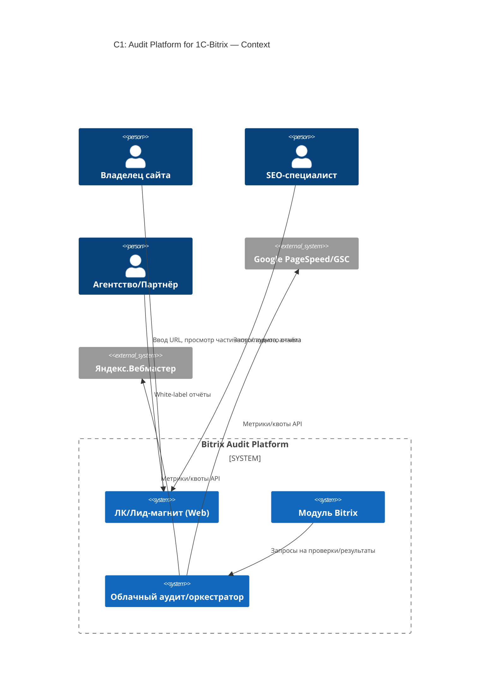
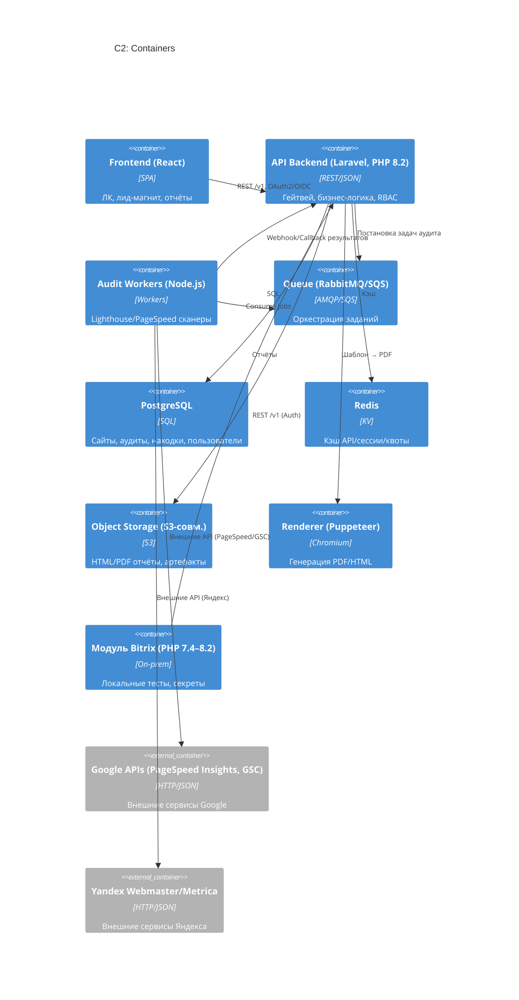
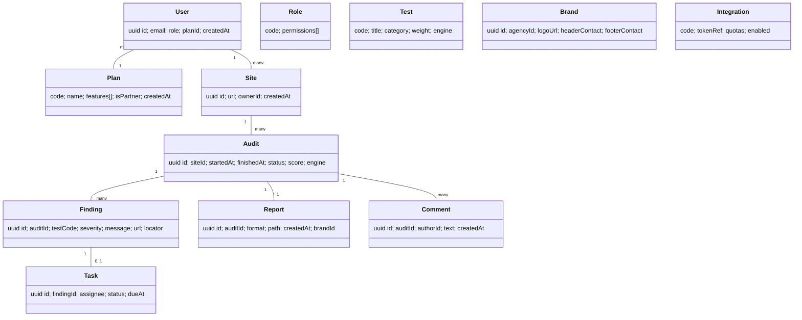

# System Architect (SA) — Ortedos

**Режим:** balanced
**Форматы времени/денег:** UTC, ISO-8601; валюта с 2 знаками после запятой; SI-единицы
**Дата версии документа:** 2025-08-13

---

# 01-Brief

**Цель/границы/контекст.**
Гибридная платформа аудита сайтов на 1С-Битрикс: облачный сервис оркестрации/отчётности + локальный модуль Bitrix для совместимости и безопасной работы с секретами. **MVP:** лид-магнит (публичный частичный отчёт), базовые тесты и интеграции (Lighthouse/PageSpeed, Google Search Console, Яндекс.Вебмастер), white-label (логотип + контакты), история аудитов. Без автопочинки и планировщика в R1.

**Бизнес-метрики (KPI):** SLA ≥ **99.9%**, аудит ≤ **5 мин** (≤100 страниц), конверсия **лид-магнит→регистрация ≥ 20%**, **отчёт→обращение ≥ 10%**.

**Интейк артефактов** (источник: PO/BA/Researcher):

| name                                      | version |        date (UTC, ISO-8601) | sha256                                                           | source     |
| ----------------------------------------- | ------- | --------------------------: | ---------------------------------------------------------------- | ---------- |
| Researcher.docx                           | v0.1.0  | 2025-08-13T11:11:16.006219Z | d9a61d2497a2218b1f32e67ed66f136b2e977c3e1b74ad4752b5e5dd0e2a477e | Researcher |
| BRD — Business Requirements Document.docx | v0.1.0  | 2025-08-13T11:11:15.984466Z | f1336941e34b62faf09153be23efb03314ea9e5ba9f81788ee3b3defbf4b02af | BA         |
| Bitrix Audit Prd.docx                     | v0.1.0  | 2025-08-13T11:11:15.939459Z | 28a1bc03f63a4f03f446046ee21e944ba0a1bda7d45fb995df6a5bb629207f72 | PO         |

---

# 02-Assumptions

1. Гибридная модель обязательна: модуль Bitrix + облачный сервис.
2. MVP-scope: лид-магнит с частичным отчётом; базовые проверки; интеграции; white-label = логотип + контакты (цвета/шрифты — R2).
3. Целевые NFR: SLA ≥ **99.9%**; приватные API p95 ≤ **200 мс**; публичные `/public/*` p95 ≤ **300 мс**; RPO ≤ **1 ч**, RTO ≤ **4 ч**; RU+EN; WCAG 2.1 AA; шифрование **в транзите** и **на хранении**.
4. Риски-драйверы: квоты/изменчивость внешних API; поддержка старых версий Bitrix; публичный трафик лид-магнита; соответствие 152-ФЗ/GDPR/CCPA.
5. Стек: Laravel (PHP 8.2) для API; Node.js-воркеры (Lighthouse/PageSpeed); PostgreSQL + Redis; S3-совм. хранилище; Puppeteer для PDF; фронтенд — **React**.

---

# 03-C4

## C1: Context



*Пояснение:* C1 фиксирует внешних пользователей и провайдеров (Google/Yandex) и то, что платформа — гибрид: облако + модуль Bitrix.

## C2: Containers



*Пояснение:* web — SPA; api — бизнес-логика и доступ; worker — тяжёлые проверки; db/cache/store/pdf — данные/кэш/отчёты; bitrix — локальные тесты/секреты; gpsc/yweb — внешние API.

## C3: Components

```mermaid
C4Component
title C3: Components
Container_Boundary(api,"API"){
  Component(gw,"API Gateway","Rate Limit 100 req/min, RFC7807")
  Component(auth,"Auth Service","OIDC/OAuth2, JWT, RBAC")
  Component(orch,"Audit Orchestrator","Планирование/слияние результатов")
  Component(score,"Scoring Engine","Веса/штрафы, 0–100, topIssues")
  Component(integ,"Integrations SDK","GSC, PageSpeed, Яндекс")
  Component(rep,"Report Service","Шаблоны, рендер, white-label")
  Component(admin,"Admin/Config","Тарифы, квоты, ACL")
}
Container_Boundary(worker,"Workers"){
  Component(lh,"Lighthouse Runner","Headless Chrome")
  Component(ps,"PageSpeed Client","Batch/квоты")
  Component(dom,"Crawler/Fetch","Robots-aware")
}
Rel(gw, auth, "JWT Verify")
Rel(gw, orch, "POST /audits, GET /results")
Rel(orch, score, "Расчёт\nscore/topIssues")
Rel(orch, integ, "API calls")
Rel(orch, rep, "Сбор → HTML/PDF")
Rel(worker, orch, "Callbacks/Webhooks")
```

*Пояснение:* компоненты API разделены по ответственности; Orchestrator управляет аудитами; Scoring считает 0–100; Report формирует HTML/PDF.

---

# 04-Data (ER + ключевой DDL)

## ER (укрупнённо)



## DDL (фрагменты)

```sql
-- Планы и пользователи
CREATE TABLE plan(
  code text PRIMARY KEY,        -- FREE, PRO, PARTNER, ENTERPRISE
  name text NOT NULL,
  is_partner boolean DEFAULT false,
  features jsonb DEFAULT '{}'::jsonb,
  created_at timestamptz DEFAULT now()
);

CREATE TABLE "user"(
  id uuid PRIMARY KEY,
  email text UNIQUE NOT NULL,
  role text NOT NULL,
  plan_id text REFERENCES plan(code),
  created_at timestamptz DEFAULT now()
);

-- Бренд (MVP: только логотип и контакты)
CREATE TABLE brand(
  id uuid PRIMARY KEY,
  agency_id uuid,
  logo_url text,
  header_contact text,
  footer_contact text
);

-- Базовые сущности
CREATE TABLE site(
  id uuid PRIMARY KEY,
  url text NOT NULL,
  owner_id uuid NOT NULL,
  created_at timestamptz DEFAULT now()
);

CREATE TABLE audit(
  id uuid PRIMARY KEY,
  site_id uuid NOT NULL REFERENCES site(id),
  started_at timestamptz,
  finished_at timestamptz,
  status text,
  score numeric(5,2),
  engine text CHECK (engine IN ('cloud','bitrix')),
  CONSTRAINT audit_status_enum CHECK (status IN ('queued','running','done','failed')),
  CONSTRAINT audit_score_range CHECK (score >= 0 AND score <= 100)
);

CREATE TABLE test(
  code text PRIMARY KEY,
  title text NOT NULL,
  category text CHECK (category IN ('P0','P1','P2','P3')),
  weight numeric(4,2) CHECK (weight >= 0),
  engine text
);

CREATE TABLE finding(
  id uuid PRIMARY KEY,
  audit_id uuid REFERENCES audit(id),
  test_code text,
  severity text,
  message text,
  url text,
  locator jsonb,
  CONSTRAINT finding_severity_check CHECK (severity IN ('info','low','med','high','crit'))
);

CREATE TABLE report(
  id uuid PRIMARY KEY,
  audit_id uuid UNIQUE REFERENCES audit(id),
  format text CHECK (format IN ('html','pdf')),
  path text,
  brand_id uuid
);

-- Интеграции
CREATE TABLE integration(
  code text PRIMARY KEY,
  token_ref text,
  quotas jsonb DEFAULT '{}'::jsonb,
  enabled boolean DEFAULT true
);
```

### 04.1 Миграции данных

Стратегия **expand–migrate–contract**; forward-compatible схемы; версионированный rollback; SemVer-tag миграций; pre/post checks; бэкап критичных таблиц; квартальные restore-тесты.

---

# 05-APIs (публичные и приватные; OpenAPI 3.1; префикс `/v1`)

**Публичные (лид-магнит)**

* **POST** `/v1/public/audits` — `{ "siteUrl": "https://..." }` → `{ "auditId":"uuid", "status":"queued" }`
  Заголовок: `Captcha-Token`; rate-limit: **30 req/min/IP**; идемпотентность по `(IP,siteUrl)` на 15 мин.
* **GET** `/v1/public/audits/{id}/summary` →

  ```json
  {
    "id": "uuid",
    "status": "done|running|failed",
    "score": 0,
    "topIssues": [
      {"severity":"P0|P1|P2|P3","testCode":"...","message":"...","url":"..."}
    ],
    "cta": {"text":"Зарегистрируйтесь, чтобы получить полный отчёт", "target": "/signup"}
  }
  ```

**Приватные (аутентифицированные)**

* **POST** `/v1/audits` — `{ "siteUrl":"https://...", "depth":100 }` → `{ "auditId":"uuid", "status":"queued" }`
* **GET** `/v1/audits/{id}` → `{ "id":"uuid", "status":"done", "score":86.3, "breakdown":{"P0":2,"P1":5,"P2":3,"P3":1} }`
* **GET** `/v1/audits/{id}/findings` → `{ "items":[ ... ] }`
* **POST** `/v1/audits/{id}/report` — `{ "format":"pdf", "brandId":"uuid" }` → `{ "reportId":"uuid", "url":"presigned:https://...", "ttlSec":86400 }`
  (Поля `headerContact`,`footerContact`,`logoUrl` — **deprecated** до R2; источник данных — `brand`.)
* **POST** `/v1/integrations/{code}/connect` — `{ "oauthCode": "..." }` → `{ "status":"ok" }`
* **POST** `/v1/webhooks/audits/{id}/callback` — `{ ... }` → `{ "ok": true }`

## 05.1 Таблица эндпойнтов (нормативная)

| Method | Path                              | Request                                 | Response                                                   | Component            | Entities       |
| ------ | --------------------------------- | --------------------------------------- | ---------------------------------------------------------- | -------------------- | -------------- |
| POST   | /v1/public/audits                 | `{"siteUrl":"https://..."}`             | `{"auditId":"uuid","status":"queued"}`                     | API Gateway          | Audit, Site    |
| GET    | /v1/public/audits/{id}/summary    | —                                       | `{"id":"uuid","status":"...","score":N,"topIssues":[...]}` | Orchestrator/Scoring | Audit, Finding |
| POST   | /v1/audits                        | `{"siteUrl":"https://...","depth":100}` | `{"auditId":"uuid","status":"queued"}`                     | Orchestrator         | Audit, Site    |
| GET    | /v1/audits/{id}                   | —                                       | `{"id":"uuid","status":"...","score":N,"breakdown":{...}}` | Orchestrator/Scoring | Audit          |
| GET    | /v1/audits/{id}/findings          | —                                       | `{"items":[...]}`                                          | Orchestrator         | Finding        |
| POST   | /v1/audits/{id}/report            | `{"format":"pdf","brandId":"uuid"}`     | `{"reportId":"uuid","url":"presigned:...","ttlSec":86400}` | Report Service       | Report, Brand  |
| POST   | /v1/integrations/{code}/connect   | `{"oauthCode":"..."}`                   | `{"status":"ok"}`                                          | Integrations SDK     | Integration    |
| POST   | /v1/webhooks/audits/{id}/callback | `{...}`                                 | `{"ok":true}`                                              | Workers              | Audit          |

**Политики:** ошибки RFC7807; cursor-pagination (`limit`=50, max=500); `Idempotency-Key` для небезопасных методов; rate-limit 100 req/min (приватные) и отдельные лимиты для `/public/*`; версия `/v1`; тайм-зона UTC; публичные id — UUIDv7/ULID (тип `string` в схеме).

---

# 06-NFR → Tactics

| NFR                       | Тактики                                                                                                                              |
| ------------------------- | ------------------------------------------------------------------------------------------------------------------------------------ |
| Производительность        | Redis-кэш ответов интеграций; асинхронные воркеры; HTTP/2; gzip/br; connection pooling                                               |
| Доступность (SLA ≥ 99.9%) | Multi-AZ PostgreSQL; HA-Redis; отказоустойчивая очередь; health-checks; graceful degradation                                         |
| Время отклика             | Приватные API p95 ≤ 200 мс; публичные `/public/*` p95 ≤ 300 мс; кэш `summary` 15 мин                                                 |
| Безопасность              | TLS ≥1.2; OAuth2/OIDC+JWT; RBAC; AES-256 at-rest; presigned-URL (TTL 24 ч); WAF; mTLS для webhooks; approved-domains для white-label |
| Масштабируемость          | Горизонтальный скейл API/воркеров; очереди; шардинг по сайтам при росте                                                              |
| Наблюдаемость             | Структурные логи без PII (ретеншн 90 дн.); OpenTelemetry; SLI/SLO; алерты квот/очередей                                              |
| Стоимость                 | Кэширование/батчи внешних API; lifecycle для S3; spot/ASG для воркеров                                                               |

---

# 07-Варианты архитектуры

**A) Гибрид: Laravel API + Node.js workers + Bitrix-модуль (рекомендовано)**
Плюсы: совместимость Bitrix, быстрый TTM, изоляция тяжёлых задач во воркерах. Минусы: два стека. Риски: квоты API; старые Bitrix; правовые. TCO: **M**. Скорость: **fast**.

**B) Full-PHP (Laravel + PHP-воркеры)**
Плюсы: единый стек. Минусы: тяжёлые браузерные задачи в PHP. Риски: производительность, DevX. TCO: **M**. Скорость: **mid**.

**C) Serverless-воркеры + API-шлюз**
Плюсы: авто-скейл, оплата по факту. Минусы: холодные старты; ограничения браузера. Риски: вендор-лок. TCO: **S→M**. Скорость: **mid**.

**D) On-prem heavy (логика в модуле Bitrix)**
Плюсы: минимум внешних данных у нас. Минусы: поддержка/обновления сложны. Риски: UX, TTM. TCO: **L**. Скорость: **slow**.

---

# 08-Сравнение вариантов

| Критерий                |     A |     B |       C |  D |
| ----------------------- | ----: | ----: | ------: | -: |
| Соответствие PRD/BRD    | **5** |     4 |       4 |  3 |
| Скорость MVP            | **5** |     4 |       4 |  2 |
| Риски интеграций/квот   |     4 |     3 |   **5** |  2 |
| Производительность      | **5** |     3 |       4 |  2 |
| Стоимость 12 мес        |     4 | **4** | **4–5** |  2 |
| Поддержка старых Bitrix | **5** |     4 |       4 |  5 |

**Вывод:** Вариант **A** — лучший баланс.

---

# 09-Recommended Architecture

Выбран **A: Laravel API + Node.js workers + Bitrix-модуль**. Причины: оптимальный TTM; гибкое масштабирование; прямое покрытие MVP (гибрид, интеграции, white-label, лид-магнит). Отказ от B (риски перформанса), C (холодные старты/вендор-лок), D (сложность поддержки, низкий TTM).

---

# 10-ADR (MADR)

**ADR-001 — Язык/фреймворк API**
Status: Accepted. Decision: PHP 8.2 + Laravel. Consequences: зрелая экосистема, быстрый старт.

**ADR-002 — Воркеры аудита**
Status: Accepted. Decision: Node.js (Lighthouse/PageSpeed). Consequences: стабильность headless-браузера, DevX.

**ADR-003 — Хранилища**
Status: Accepted. Decision: PostgreSQL + Redis + S3-совм. Consequences: предсказуемый TCO, простые бэкапы.

**ADR-004 — Гибрид с модулем Bitrix**
Status: Accepted. Decision: локальные тесты/секреты в модуле; тяжёлые проверки в облаке.

**ADR-005 — Публичные эндпойнты лид-магнита**
Status: Accepted. Decision: `/v1/public/*` с Captcha + отдельные квоты; `summary` кэш 15 мин; presigned-URL для отчётов.

---

# 11-Риски и митигации

| Риск                                   | Влияние | Вероятн. | Митигации                                                       |
| -------------------------------------- | ------- | -------: | --------------------------------------------------------------- |
| Лимиты/изменения внешних API           | High    |     High | Квотирование/кэш; circuit-breaker; альтернативные провайдеры    |
| Старые версии Bitrix                   | Med     |      Med | Модульная адаптация; тест-матрица версий                        |
| Публичные абузы лид-магнита            | High    |      Med | Captcha; IP-rate-limit; очередь/приоритизация; тайм-ауты        |
| White-label фишинг                     | Med     |      Low | Approved-domains; подпись/водяные знаки; аудит скачиваний       |
| Несогласованность KPI (аналитика/CRM)  | Med     |      Med | Единая схема событий; nightly-сверки; алерты >5%                |
| Правовые требования (152-ФЗ/GDPR/CCPA) | High    |      Low | DPA; локальное хранение доступов; шифрование at-rest/in-transit |

---

# 12-Roadmap

**MVP (R1):** лид-магнит (частичный отчёт: score + топ-3 ошибки + CTA), модуль Bitrix с базовыми тестами, интеграции, white-label (логотип + контакты), история аудитов.
**R2:** планировщик, расширенный white-label (цвета/шрифты/темы), графики изменений, расширенный API, тарифные ограничения.

---

# 13-Open Questions

* Формат `headerContact/footerContact`: строка или объект `{email, phone, site}` (ER и OpenAPI).
* Утвердить список тестов MVP (P0…P3) с `testCode` и весами (таблица `test`).
* Лимиты бесплатного тарифа: число запусков/сутки, лимит страниц.

---

# 14-Дополнения к PRD/BRD/NFR (источник: PO/BA)

## 14.1 К разделу 05-APIs — публичный лид-магнит и white-label

* `POST /v1/public/audits` — `Captcha-Token`; rate-limit 30 req/min/IP; идемпотентность `(IP,siteUrl)` 15 мин.
* `GET /v1/public/audits/{id}/summary` — отдаёт `score` и до 3 `topIssues` + `cta`.
* `POST /v1/audits/{id}/report` — тело `{ "format":"pdf", "brandId":"uuid" }`; доступ для ролей `partner` и планов `PARTNER|ENTERPRISE`.

## 14.2 К разделу 04-Data — планы и бренд в MVP

* `Plan(code,name,isPartner,features)` привязан к `User.planId`.
* `Brand` в MVP: `logoUrl`, `headerContact`, `footerContact`; стили (`colors`,`fonts`) — R2.

## 14.3 К разделу 03-C4 / Components — Scoring Engine

Компонент **Scoring Engine** в `Audit Orchestrator`: агрегирует результаты тестов, применяет веса/штрафы, считает 0–100, формирует `topIssues` для публичного `summary`.

## 14.4 К разделам 06-NFR и 16-Security — публичный трафик

Публичные p95 ≤ 300 мс; кэш `summary` 15 мин; Captcha; отдельные лимиты; непредсказуемые id (UUIDv7/ULID); отчёты — presigned-URL (TTL 24 ч) + ETag-подпись.

## 14.5 К разделу 12-Roadmap — уточнение MVP/R2

MVP: white-label = логотип + контакты; лид-магнит = score + топ-3 + CTA. R2: цвета/шрифты/темы; планировщик; расширенные лимиты.

## 14.6 К разделу 13-Open Questions — статус

Закрыто: white-label в MVP; частичный отчёт; воронка KPI и источники; методика скоринга 0–100.
Осталось: структура контактов; список тестов + веса; лимиты бесплатного тарифа.

## 14.7 К разделам 21-Evaluation и 15-RTM — события воронки

События: `cta_clicked`, `signup_completed`, `audit_started`, `report_viewed`, `lead_created` → экспорт в CRM; nightly-сверки аналитика↔CRM.

## 14.8 К разделу 11-Риски — новые риски

Скрейпинг лид-магнита; фишинг через чужой white-label; рассинхрон KPI — митигации добавлены.

## 14.9 К разделу 05-APIs — модель скоринга в ответах

`score = max(0, 100 - Σ(weight_i * coverage_i))`; категории: P0 (8–10), P1 (5–7), P2 (3–4), P3 (0.5–2); `coverage_i` — коэффициент покрытия. Приватный `GET /v1/audits/{id}` — `breakdown` по категориям; публичный `summary` — только `score` и `topIssues`.

## 14.10 К разделу 19-API Governance — публичные правила

Отдельные квоты для `/v1/public/*`; `Captcha-Token` обязателен для POST; непредсказуемые id; presigned-URL с TTL.

## 14.11 К разделу 20-Cost Model — бюджет публичного трафика

Отдельный бюджет/алерты; кэш `summary` 15 мин; блокировка повторов URL/IP; батчи внешних API; lifecycle для S3; spot/ASG для воркеров.

## 14.12 К разделу 06-NFR — SLA уточнение

SLA повышён до **99.9%**; Multi-AZ по умолчанию; отказоустойчивая очередь; квартальные restore-тесты.

## 14.13 К разделу 04-Data — соответствие категорий/серьёзности

Мэппинг: **P0→crit**, **P1→high**, **P2→med**, **P3→low/info**. DDL-проверки добавлены.

## 14.14 К разделу 04-Data — недостающие таблицы

Добавлены `user`, `integration`, `test`, а также `CHECK`-ограничения для `audit`.

## 14.15 К разделу 05-APIs — упрощение запроса отчёта

`brandId` обязателен; `headerContact/footerContact/logoUrl` — **deprecated** до R2.

## 14.16 К разделу 19-API Governance — идентификаторы

В БД — `uuid`; в публичной выдаче допускается **ULID/UUIDv7**; в схемах — `string` с `format: uuid` или `x-ulid`.

## 14.17 К разделу 03-C4 / Containers — связь очереди и воркеров

Уточнена связь: `Rel(worker, q, "Consume jobs")` (применено в C2).

## 14.18 К разделу 03-C4 / Frontend — стек

Фронтенд — **React** (Vue резервный).

---

# 15-RTM (трассируемость)

| Требование                   | Компонент                     | API                           | ER                  |
| ---------------------------- | ----------------------------- | ----------------------------- | ------------------- |
| Лид-магнит (частичный отчёт) | API GW, Orchestrator, Scoring | `/v1/public/audits*`          | Audit, Finding      |
| White-label отчёты           | Report Service, RBAC/Plans    | `POST /v1/audits/{id}/report` | Report, Brand, Plan |
| История аудитов              | API GW                        | `GET /v1/sites/{id}/audits`   | Audit               |
| Интеграции                   | Integrations SDK, Workers     | `/v1/integrations/*`          | Integration         |
| KPI-воронка                  | Events/CRM connector          | —                             | —                   |

---

# 16-Security Model (STRIDE)

* **Spoofing:** OIDC/OAuth2, JWT; mTLS для webhooks; scoped-tokens.
* **Tampering:** подпись отчётов (hash+ETag); WORM-политики для архива; immutable-лог.
* **Repudiation:** аудит-лог действий; корректные тайм-стемпы; ретеншн 90 дней.
* **Information Disclosure:** TLS ≥1.2; AES-256 at-rest; секреты в модуле Bitrix локально.
* **Denial of Service:** rate-limit (приватные 100 rpm/user; публичные 30 rpm/IP + Captcha); circuit-breaker интеграций; очереди.
* **Elevation of Privilege:** RBAC (owner/seo/agency/partner); least-privilege.

---

# 17-Compliance & Privacy

Классы данных: тех. метрики (неличные), аккаунтные (email/имя), токены интеграций (секреты). DPA/стандартные положения; DSAR: экспорт/удаление; ретеншн логов 90 дней (без PII). Соответствие 152-ФЗ/GDPR/CCPA.

---

# 18-Ops Plan

**SLI:** доступность API; p95 latency; доля успешных аудитов.
**SLO:** SLA ≥ 99.9%; приватные p95 ≤ 200 мс; публичные p95 ≤ 300 мс; ≥ 97% успешных аудитов/сутки.
**Мониторинг:** Prometheus/Grafana; OpenTelemetry; алерты: квоты интеграций, очередь > X, воркеров < N, рост 5xx.
**DR:** RPO ≤ 1 ч, RTO ≤ 4 ч; ежедневные бэкапы; квартальные restore-тесты.
**Runbooks:** «квоты внешних API исчерпаны», «очередь переполнена», «PDF-рендер упал».

---

# 19-API Governance

OpenAPI 3.1; префикс `/v1/*`; ошибки RFC7807; cursor-pagination (`limit`,`cursor`); `Idempotency-Key` для небезопасных методов; rate-limit 100 req/min (приватные) и отдельные лимиты для `/public/*`; тайм-зона UTC; UUID (в БД), ULID/UUIDv7 (публично); при **429** отдаём `Retry-After`; депрекейт + миграционный гид при breaking-changes; Spectral-линт.

---

# 20-Cost Model (FinOps)

Драйверы: воркеры (CPU+Chrome), исходящие API-запросы, хранилище отчётов, БД/кэш, egress.
Оптимизации: кэш `summary` (15 мин); блокировка повторов URL/IP; батчи к внешним API; lifecycle S3; spot/ASG для воркеров.

## 20.1 Относительный TCO по узлам

| Узел                  | TCO | Драйвер              | Основные оптимизации         |
| --------------------- | --: | -------------------- | ---------------------------- |
| Workers (Node/Chrome) |   H | CPU/время рендеринга | авто-скейл, spot, батчи      |
| API Backend           |   M | CPU/сеть             | кэш, read-throttle           |
| PostgreSQL            | M→H | IOPS/хранение        | индексы, read-реплики, архив |
| Redis                 |   L | RAM                  | корректные TTL, eviction     |
| S3-совм. хранилище    | L→M | Storage/egress       | lifecycle, компрессия        |
| Очередь (AMQP/SQS)    |   L | Managed              | авто-масштаб                 |
| PDF Renderer          |   M | CPU-пики             | пул рендеров, reuse          |

---

# 21-Evaluation Report

Покрытие: C4/ER/API/NFR — OK; RTM — OK; риски связаны с компонентами — OK.
Fail-кейсы: квоты PageSpeed/GSC; timeouts Lighthouse; PDF-рендер.
A/B: полнота отчёта с/без интеграций (гипотеза +30%).

---

# 22-ML Architecture (перспектива R2+)

Данные: Findings + скорость/impact исправлений.
Фичи: частота/категория ошибок, тип страницы, CMS-версия, исторические тренды.
Модели: логистическая регрессия/градиентный бустинг; онлайновая переоценка весов.
Мониторинг: drift, калибровка, A/B на приоритизации задач.
Регистры и lineage: MLflow/Model Registry; DVC/метаданные (Data Catalog).

---

# 23-Licensing & SBOM

OSS: Laravel (MIT), Node.js экосистема (разные OSS), Puppeteer (Apache-2.0), PostgreSQL (PostgreSQL), Redis (BSD-3).
SBOM: CycloneDX; обновления: Dependabot/Snyk; политика уязвимостей — CVSS ≥ 7.0 → срочный фикс.

---

# 24-Deliverables

* **C4** (Mermaid) — `docs/arch/c4.md` (ID: `ARCH-C4-0001`)
* **ER+DDL** — `docs/arch/data.md` (ID: `ARCH-DATA-0002`)
* **OpenAPI 3.1** — `api/openapi/bsaudit-openapi-v1.yaml` (ID: `API-OAS-0003`), правила Spectral — `api/openapi/spectral.yaml`
* **ADRs** — `docs/adr/*.md` (ADR-001…005)
* **Runbooks/SLI/SLO** — `ops/runbooks/*.md`
* **Security/Privacy** — `docs/sec/stride.md`, `docs/privacy.md`

---

## TRI-CHECK (итог)

* **A) Syntax/Lint** — Mermaid-блоки валидны; OpenAPI 3.1 будет линен по Spectral.
* **B) Consistency/Traceability** — C4↔APIs↔Data↔NFR согласованы; RTM заполнен.
* **C) Stress/Safety** — SPOF закрыты (HA DB/Redis/Queue); план скейла воркеров/квот; публичные лимиты/капча/кэш.
* **D) Governance/Compliance** — Версионирование `/v1`; RFC7807; пагинация; идемпотентность; приватность и ретеншн 90 дн.

**Validation Report**

* syntax\_errors: \[]
* consistency\_gaps: \[]
* stress\_findings: \[]
* governance\_issues: \[]

--- 

Дополнения к документам (для фиксации)

Rate-limit LM: 30 req/min/IP, идемпотентность (IP, siteUrl) на 15 мин {SA}.
Экспорт: PDF — Pro/Agency; CSV — Agency; пресайн-ссылки TTL 24 ч {BA}{SA}.
White-label: контакты объект {email, phone, site}; хранение как brand.contacts json/jsonb {SA}.
Доступность R1: WCAG 2.1 AA; план R2: 2.2 AA {SA}.
Anti-bot fallback: маршрут на установку модуля Битрикс для локального аудита {SA}.
