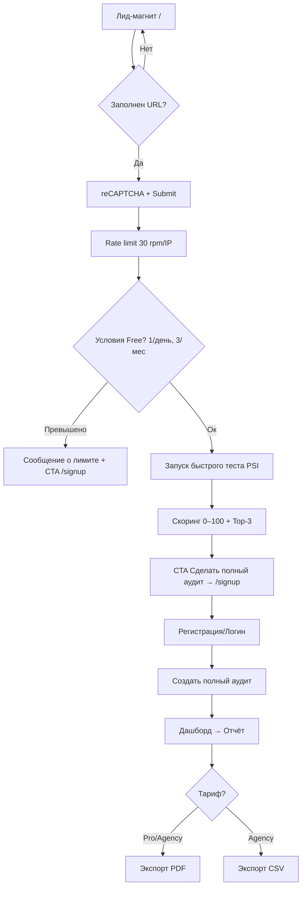

# Комплексное UI/UX-решение

## Введение

Проект: публичный **лид-магнит** (LM) для быстрой оценки сайта и личный кабинет с полным отчётом аудита. Цели R1: повысить конверсию LM→рег **≥20%** и конверсию просмотр отчёта→обращение **≥10%** {PO}{BA}. Ограничения: лимит LM **30 req/min/IP**, Free — **1/день**, **3/мес**, **≤100 URL/аудит**, SLA: **≤5 мин** на ≤100 страниц, экспорт PDF платным (Pro/Agency), CSV — Agency, white-label в MVP: **логотип+контакты** {PO}{BA}{SA}.

---

## Исследование пользователей

**Ключевые роли**

1. Владелец/директор малого e-commerce: хочет быстро понять «насколько всё плохо/хорошо» и получить понятные рекомендации {Researcher}{guess}.
2. Маркетолог/SEO-специалист: нужна детализация, приоритизация проблем (P0–P3), экспорт и white-label для отчётов клиентам {Researcher}{guess}.
3. Разработчик: важны технические метрики (Core Web Vitals, ошибки ресурсов), стабильные API/квоты и репродукция {Researcher}{guess}.

**Основные потребности**

* Быстрый «скрининг» сайта с прозрачным скорингом **0–100**, топ-3 проблем и CTA к полному аудиту {PO}{BA}.
* Полный отчёт с приоритизацией (P0–P3), чёткими шагами «как исправить» и экспортабельностью {Researcher}.
* Интеграции (PSI→batch Lighthouse), кэш/квоты: \~**240 rpm / 25k/day**, кэш по `url+strategy` {SA}.

---

## Экраны и сценарии

### Навигация (R1)

* Публично: **LM** (форма + результат), **404** {PO}{BA}.
* После регистрации: **Дашборд аудитов → Отчёт → Экспорт → Настройки бренда (WL)** → **Интеграции** {PO}{BA}{SA}.

### User Flows (Mermaid)



```mermaid
flowchart TD
  S[Отчёт] --> S1[Сводка: общий балл]
  S --> S2[Backlog: P0-P3]
  S --> S3[Категории: Тех/Контент/UX/SEO]
  S2 --> S4[Каждый тест: описание, почему важно, как исправить]
  S --> S5[White-label шапка/футер (логотип+контакты)]
  S --> S6[Интеграции не подключены → Stub + CTA Подключить]
```

---

## Wireframes

### 1) Лид-магнит (публичный)

```
+--------------------------------------------------------------+
|  Логотип                      Войти / Зарегистрироваться     |
+--------------------------------------------------------------+
|  H1: Мгновенная оценка 0–100 + топ-3 проблемы — бесплатно    |
|  [ https://example.com __________________________ ] [Проверить]|
|  ☐ Я не робот (reCAPTCHA)                                    |
|  Hint: Проверка займет ~30 сек. Лимит 30 req/min/IP          |
+--------------------------------------------------------------+
|  Результат: Балл: 78/100  [↑ Подробнее]                      |
|  ▸ Проблема 1 (P0)  ▸ Проблема 2 (P1)  ▸ Проблема 3 (P1)      |
|  [Сделать полный аудит → /signup]                            |
+--------------------------------------------------------------+
|  FAQ | Политика | Контакты                                   |
+--------------------------------------------------------------+
```

### 2) Дашборд аудитов

```
+-----------------------------------------------+
| Шапка (аккаунт)   | Меню: Аудиты | Интеграции |
+-----------------------------------------------+
| [Создать аудит]   | Фильтр | Поиск            |
+-----------------------------------------------+
| Список:  Сайт       Дата    Страниц  Балл     |
|          example    12.08   84       78/100   |
|          site2      10.08   56       62/100   |
+-----------------------------------------------+
```

### 3) Отчёт (сводка + backlog)

```
+-----------------------------------------------------------+
| White-label: [Лого клиента]  | Контакты: email/phone/site |
+-----------------------------------------------------------+
| Итоговый балл: 78/100   [PDF] [CSV (Agency)]              |
| Категории: Тех ▪ Контент ▪ UX ▪ SEO                       |
| Топ приоритетов: P0 (2) | P1 (5) | P2 (7) | P3 (10)       |
+-----------------------------------------------------------+
| Backlog (сорт: P0→P3):                                    |
| [P0] CLS > 0.25 — как исправить… [Подробнее]              |
| [P1] H1 дублируется — как исправить… [Подробнее]          |
| ...                                                       |
+-----------------------------------------------------------+
| Интеграции: GSC/ЯВ — не подключены [Подключить]           |
+-----------------------------------------------------------+
```

### 4) Пустое состояние интеграций

```
+----------------------------------------+
| Интеграции не подключены               |
| Чтобы увидеть органический топ и трафик|
| подключите Google Search Console       |
| [Подключить GSC]                       |
+----------------------------------------+
```

---

## Интерактивные элементы и состояния

**Кнопки/ссылки (микротексты, RU):**

* `[Проверить]` (LM submit) — tooltip: «Проверка займет до 30 сек» {BA}.
* `[Сделать полный аудит]` — подзаг: «Подробный отчёт с рекомендациями» {BA}.
* `[Подключить GSC]`/`[Подключить Яндекс.Вебмастер]` {PO}{BA}.
* `[Экспорт PDF]` (Pro/Agency), `[Экспорт CSV]` (Agency) {BA}{SA}.

**Состояния форм:**

* Loading: спиннер + «Собираем метрики…» {BA}.
* Rate-limit: «Превышен лимит 30 запросов/минуту с вашего IP. Повторите позже» {SA}.
* Free-лимиты: «Достигнут лимит: 1 проверка в день / 3 в месяц» + CTA `/signup` {PO}{BA}.
* Anti-bot: «Сайт защищён. Установите модуль Битрикс для локального аудита» + ссылка {SA}.
* Ошибки PSI/Lighthouse: «API временно недоступно. Попробуйте позже» {SA}.

---

## Цвета, типографика, отступы

**Палитра (продуктовая, не WL):**

* Основной: нейтральный тёмный текст; Акцент: синий для CTA; Ошибки: красный; Успех: зелёный {guess}.
* Контрасты: минимум **4.5:1** для текста, **3:1** для UI-элементов {SA}.

**Типографика:**

* Заголовки: 32/24/20/16 px; Тело: 14–16 px; Межстрочный 1.4–1.6 {SA}{guess}.

**Отступы/сетка:**

* Блоки: **8-pt** шаг (8/16/24/32/48) {SA}.

**Компоненты (MVP):**

* Button, Input, Select, Alert, Tabs, Table, Pagination, Badge, Tooltip, Empty State {SA}.

*Примечание:* White-label в R1 кастомизирует **только шапку/футер отчёта** (логотип+контакты) без изменений палитры/шрифтов {PO}{BA}.

---

## Требования по доступности (WCAG 2.2)

* Целевой уровень R1: **WCAG 2.1 AA**; план R2: **2.2 AA** {PO}{BA}{SA}.
* Фокус-стили видимые; клавиатурная навигация полноценно покрывает формы и таблицы {SA}.
* Поля форм с `aria-*`, ошибки с программными подсказками, reCAPTCHA с альтернативой {SA}.
* Порог анимаций: предпочесть «уменьшение движения» по `prefers-reduced-motion` {SA}.

---

## Адаптивная/мобильная версия

* **Mobile-first**: LM — одно поле URL, CTA под ним; отчёт — свернутые секции (аккордеон), таблицы с горизонтальным скроллом {SA}.
* Брейкпоинты: 360/768/1024/1280 {SA}{guess}.
* Sticky CTA на мобильном в LM и в отчёте (PDF/Signup) {BA}{guess}.

---

## MVP и R2+

**MVP (R1):**

* LM: URL + reCAPTCHA + результат (0–100, top-3, CTA `/signup`), лимиты 30 rpm/IP {PO}{BA}{SA}.
* Полный аудит: сводка, backlog P0–P3, категории, тест-карточки, sampling >1000 страниц {SA}.
* Интеграции: PSI; кэш `url+strategy`; квоты \~240 rpm/25k/day {SA}.
* Экспорт: PDF — Pro/Agency; CSV — Agency; presigned-URL TTL 24 ч {BA}{SA}.
* White-label: логотип+контакты (объект `{email, phone, site}`) {PO}{BA}{SA}.
* Аналитика: `lead_test_done`, `cta_full_audit_click`, `audit_started`, `report_viewed` (+`signup`, `export_pdf/csv`) {BA}{SA}.

**R2+:**

* Повышение доступности до **WCAG 2.2 AA** {PO}{BA}{SA}.
* Batch-Lighthouse, дополнительные интеграции, расширенные WL-настройки, сегментация отчётов, шаблоны экспортов {SA}{guess}.

---

## Обоснование

* **Конверсия:** LM с чётким value-prop «0–100 + топ-3» сокращает когнитивную нагрузку и подталкивает к регистрации ради полного отчёта {PO}{BA}.
* **Приоритизация:** P0–P3 + скоринг **100 − Σ(штрафов)** позволяет быстро сфокусироваться на критичных задачах {BA}{Researcher}.
* **Ограничения Free:** лимиты создают дефицит и двигают к апгрейду без ухудшения первичного опыта {PO}{BA}.
* **WL минимализм в R1:** снижает сложность и стоимость поддержки {PO}{BA}{SA}.

---

## Альтернативы

1. **Сводка отчёта как «карточки KPI» vs «один большой термометр»**

   * Карточки: лучше читаемость/мобильность; немного больше кликов {guess}.
   * Термометр: сильный визуал; хуже масштабируемость под категории {guess}.
     **Выбор:** карточки KPI + общий индикатор в шапке {BA}.

2. **Навигация «Сайдбар фиксированный» vs «Табы сверху»**

   * Сайдбар: лучше для глубоких отчётов; требует места {guess}.
   * Табы: проще; хуже при росте секций {guess}.
     **Выбор:** сайдбар на десктопе, табы/аккордеоны на мобильном {SA}.

3. **Экспорт «моментальный» vs «фоновая генерация»**

   * Моментальный: быстрее, но ограничен по объёму {guess}.
   * Фоновый: масштабируем, требует уведомлений {guess}.
     **Выбор R1:** моментальный (до заданного веса), fallback — «готовим, пришлём ссылку» через presigned-URL {SA}.

---

## UX-метрики и DoD

**Продуктовые метрики:**

* LM→рег ≥ **20%**; отчёт→обращение ≥ **10%** {PO}{BA}.
* Время до первого результата LM: p75 ≤ **30 сек** {SA}{guess}.
* Время генерации полного отчёта: p90 ≤ **5 мин** (≤100 страниц) {SA}.

**События (названия зафиксированы):**
`lead_test_done`, `cta_full_audit_click`, `audit_started`, `report_viewed`, `signup`, `export_pdf`, `export_csv` {BA}{SA}.

**DoD (для R1):**

* Доступность: Lighthouse Accessibility ≥ **90** на ключевых экранах {SA}{guess}.
* Контраст/фокус/клавиатура — соответствуют WCAG 2.1 AA {SA}.
* Экспорт PDF/CSV проходит smoke-тест (10 разных отчётов) {SA}.
* Rate-limit и Free-лимиты покрыты e2e-тестами {SA}.

---

## Заключение

Данный дизайн закрывает цели R1, минимизируя риски по производительности и поддержке, и задаёт масштабируемую структуру под R2+ (доступность 2.2 AA, batch-Lighthouse, расширенный WL) {PO}{BA}{SA}.

---

**User Journey Map**

1. **Главная (публичная стартовая страница продукта)**

   * Шапка: логотип, краткое УТП, навигация (Отчёт/Цены/Вход) {guess}.
   * Hero-блок: поле URL сайта + reCAPTCHA + кнопка «Проверить»; подпись «Мгновенная оценка 0–100 + топ-3 проблемы — бесплатно» {PO}{BA}.
   * Технические ограничения: rate-limit **30 req/min/IP**, идемпотентность по `(IP, siteUrl)` на 15 мин; при превышении — сообщение об ограничении и CTA «Зарегистрироваться» {SA}.
   * Юзкейс Free: подсказка о лимитах **1 проверка/день, 3/месяц** {PO}{BA}{SA}.
   * Доступность: видимый фокус на поле URL и кнопке; aria-лейблы; контраст ≥4.5:1 {SA}.

2. **Быстрый тест (лид-магнит, LM) → Результат**

   * Состояние загрузки: «Собираем метрики… \~до 30 сек» {guess}.
   * Результат: общий балл **0–100**, три главные проблемы (P0–P1), краткие рекомендации, CTA «Сделать полный аудит → /signup» {PO}{BA}.
   * Ошибки/edge-кейсы:
     • Превышен лимит Free → сообщение + «Апгрейд тарифа» {PO}{BA}{SA}.
     • Ошибка PSI/квоты → «API временно недоступно, повторите позже» {SA}.
     • Сайт защищён антибот-механизмами → предложение установить модуль Битрикс для «ручного» локального аудита {SA}.

3. **Регистрация / вход**

   * Минимальная форма (email + пароль) и/или соц. вход {guess}.
   * Подтверждение email (по возможности асинхронно, не блокируя вход) {guess}.
   * После входа — авто-перенаправление на экран запуска полного аудита для введённого ранее URL {guess}.

4. **Запуск полного аудита**

   * Параметры по умолчанию: глубина до **100 страниц**, SLA: **≤5 минут** (для ≤100 стр.); при >1000 — **sampling** (сайтмап/GSC) {SA}{Researcher}{BA}.
   * Запуск → страница прогресса: статус, оценка готовности, возможность свернуть в фон; при блоке антиботом — явный переход к установке модуля {SA}.
   * Системные лимиты Free подтверждаются до старта (1/день, 3/мес, ≤100 URL) {PO}{BA}{SA}.

5. **Отчёт (сводка + backlog)**

   * Шапка white-label: **логотип + контакты** `{email, phone, site}`; без смены цветов/шрифтов {PO}{BA}{SA}.
   * Сводка: итоговый балл, счётчики P0–P3; методика «**100 − Σ(штрафов)**» {BA}{Researcher}.
   * Backlog: список проблем с приоритетами **P0–P3**, категориями (Тех/Контент/UX/SEO), сортировками/фильтрами/поиском; каждая проблема — «Почему важно / Как исправить / Ресурсы» {Researcher}{SA}.
   * Интеграции: если GSC/Я.Вебмастер не подключены — пустое состояние + CTA «Подключить» {PO}{BA}{SA}.
   * Экспорт: **PDF** — для Pro/Agency; **CSV** — только Agency; раздача через presigned-URL **TTL 24 ч** {BA}{SA}.
   * Доступность отчёта: WCAG **2.1 AA** в R1 {SA}.

6. **Конверсия и следующий шаг**

   * Основной CTA после просмотра отчёта: «Запросить консультацию» или «Передать отчёт коллеге» (генерация ссылок/экспорт) {PO}{BA}{guess}.
   * Целевые KPI R1: **LM→рег ≥20%**, **отчёт→обращение ≥10%** — аналитика фиксируется событиями {BA}.
   * События: `lead_test_done`, `cta_full_audit_click`, `audit_started`, `report_viewed`, `signup`, `export_pdf`, `export_csv` {BA}{SA}.

7. **Альтернативные пути и восстановление**

   * Пользователь уходит до регистрации → e-mail capture (с согласием) «Выслать сводку LM» {guess}.
   * Длительный аудит → уведомление по e-mail/внутри продукта; лимит времени соблюдён для ≤100 стр., sampling для крупных сайтов {SA}{Researcher}.
   * Ошибки экспорта → повторная генерация, проверка статуса, ограничение размера и «фоновая выдача» по presigned-URL {SA}.

---

**User Personas**

1. **Собственник малого бизнеса (Owner)**

   * Цели: быстро понять состояние сайта «в целом», приоритеты и понять, стоит ли вкладываться {Researcher}{guess}.
   * Поведение: сразу вводит URL на главной, читает топ-3 проблем, готов зарегистрироваться при чёткой пользе {PO}{BA}{guess}.
   * Боли: много «технических» терминов, отсутствие приоритизации, долгие аудиты {Researcher}{guess}.
   * Критерии успеха: простота, ясная оценка 0–100, ясные шаги «что делать дальше» {PO}{BA}.

2. **Маркетолог/SEO-специалист (Marketer/SEO)**

   * Цели: получить детализацию P0–P3 по категориям, экспорт для отчётности, white-label для клиента {Researcher}{BA}.
   * Поведение: запускает полный аудит, активно фильтрует backlog, экспортирует PDF/CSV, сравнивает с прошлым запуском {BA}{guess}.
   * Боли: «шумные» рекомендации, отсутствует сортировка по влиянию, нет экспорта/брендинга {Researcher}{guess}.
   * Критерии успеха: чёткая приоритизация, полезные «Как исправить», WL-шапка, стабильный экспорт {BA}{SA}.

3. **Разработчик/технический специалист (Developer)**

   * Цели: понять, какие именно технические проблемы мешают (CWV, производительность, доступность), как их воспроизвести/исправить {Researcher}{guess}.
   * Поведение: просматривает тех. категорию, открывает «Ресурсы», повторно прогоняет тесты после фиксов {Researcher}{guess}.
   * Боли: неоднозначные метрики, нет ссылок на первоисточники, блокировки антиботом {Researcher}{guess}.
   * Критерии успеха: конкретные шаги «как исправить», ссылки на спецификации, работающий fallback (модуль Битрикс) {SA}.

---

**Design Requirements**

1. **Информационная архитектура и навигация**

   * Публично: Главная (LM) → Результат LM → Регистрация/Вход → Запуск полного аудита → Отчёт {PO}{BA}{SA}.
   * ЛК: Дашборд аудитов, Отчёт, Экспорт, Интеграции, Настройки бренда (WL) {PO}{BA}{SA}.
   * Локализация: RU/EN; все тексты имеют ключи i18n {SA}.

2. **Ключевые UI-элементы (R1)**

   * Поле URL (валидатор домена/протокола), кнопка «Проверить», reCAPTCHA {PO}{BA}{SA}.
   * Карточка результата LM: балл 0–100, 3 проблемы, CTA «Сделать полный аудит» {PO}{BA}.
   * Экран отчёта: счётчики P0–P3, фильтры по приоритету/категории/влиянию, поиск, раскрывающиеся строки «Почему важно / Как исправить / Ресурсы» {Researcher}{SA}.
   * Экспорт: кнопка PDF (Pro/Agency), CSV (Agency); при недоступности — tooltip/disabled-состояние {BA}{SA}.
   * WL-шапка: логотип + контакты `{email, phone, site}` из `brand.contacts` {PO}{BA}{SA}.

3. **Микротексты (RU, примеры)**

   * Hero: «Мгновенная оценка 0–100 и топ-3 проблем — бесплатно» {PO}{BA}.
   * Лоадер LM: «Собираем метрики… Это займёт до 30 секунд» {guess}.
   * Лимиты: «Free-лимит: 1 проверка/день, 3/месяц, до 100 страниц» {PO}{BA}{SA}.
   * Rate-limit: «Превышен лимит 30 запросов/минуту с вашего IP. Попробуйте позже» {SA}.
   * Антибот: «Сайт защищён. Установите модуль Битрикс для локального аудита» {SA}.
   * Интеграции: «Подключите Google Search Console, чтобы увидеть органический трафик и топ-страницы» {PO}{BA}{SA}.

4. **Доступность (WCAG 2.1 AA в R1)**

   * Видимый focus-ring, навигация с клавиатуры, логичные таб-порядки {SA}.
   * Контраст текста ≥4.5:1; у иконок/контролов ≥3:1; не опираться на цвет как единственный носитель смысла {SA}.
   * ARIA-атрибуты для интерактивов, текстовые альтернативы для изображений; учёт `prefers-reduced-motion` {SA}.

5. **Производительность и SLA**

   * LM p75 время до результата ≈ ≤30 сек (цель), полный аудит p90 ≤5 мин для ≤100 стр. {SA}{Researcher}{guess}.
   * Кэш PSI по ключу `url+strategy`; квоты \~**240 req/min**, **25k/day** {SA}.
   * Sampling для сайтов >1000 стр. (sitemap/GSC) {SA}{Researcher}.

6. **План-гейтинги и тарифы**

   * Free: 1/день, 3/мес, ≤100 URL/аудит; Pro/Agency — без этих ограничений (по бизнес-правилам) {PO}{BA}{SA}{guess}.
   * Экспорт: PDF — Pro/Agency; CSV — только Agency; выдача файла — presigned-URL TTL 24 ч {BA}{SA}.
   * White-label: только логотип и контакты в R1; без кастомизации палитры/типографики {PO}{BA}.

7. **Ошибки и пустые состояния**

   * LM: неправильный URL, превышены лимиты, ошибка PSI — явные сообщения + действия восстановления {SA}.
   * Отчёт: «интеграции не подключены» — понятный stub + CTA; «нет проблем» — подсказки по улучшению {PO}{BA}{SA}{guess}.
   * Антибот: сценарий переезда на модуль Битрикс, чек-лист шагов {SA}.

8. **Аналитика и метрики (DoD)**

   * События: `lead_test_done`, `cta_full_audit_click`, `audit_started`, `report_viewed`, `signup`, `export_pdf`, `export_csv` {BA}{SA}.
   * Целевые KPI R1: LM→рег ≥20%; отчёт→обращение ≥10% {BA}.
   * Диаграммы конверсий по шагам, тайминг-метрики (TTR LM, TTR Report) {guess}.

9. **Безопасность и данные**

   * Доступы к внешним сервисам хранятся локально у клиента (модуль); шифрование **AES-256** {PO}{BA}.
   * Раздача экспортов — presigned-URL с ограничением TTL; логи без PII, ретенция/ротация по дефолту SAD {SA}.

10. **Адаптивность**

* Mobile-first, брейкпоинты \~360/768/1024/1280; sticky-CTA в LM и в отчёте (PDF/Signup) {SA}{guess}.

---
